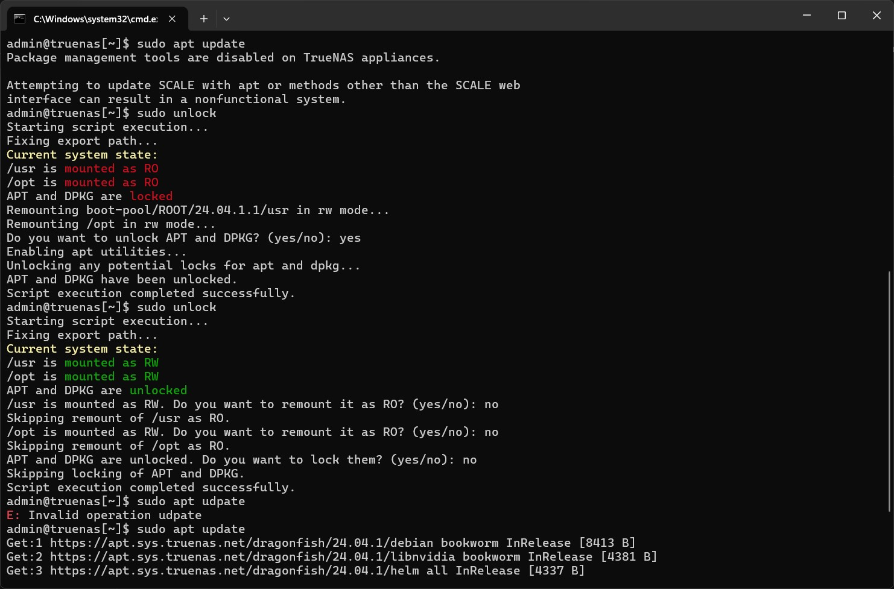

# Script to Unlock TrueNAS Scale 24.04.1.1

This script is designed to unlock TrueNAS Scale 24.04.1.1 by allowing write access to the file system and unlocking the `apt` and `dpkg` package management tools.



## Usage

1. **Download:** Download the `unlock_truenas.sh` script from this repository.

2. **Execution:** Open a terminal and execute the script with superuser (root) privileges using the following command:

    ```bash
    sudo ./unlock.sh
    ```

3. **Follow the instructions:** The script will guide you through the unlocking process. Make sure to carefully follow the displayed instructions.

4. **Restart:** Once the process is complete, restart your TrueNAS Scale system.

5. **Recommendation:** Once the system is unlocked and the partitions are writable, it is recommended to rename the `unlock_truenas.sh` script to `unlock` and copy it to `/usr/bin` for easier access using the following command:

    ```bash
    sudo cp unlock.sh /usr/bin/unlock
    ```

## Disclaimer

- This script modifies critical system settings. Use it at your own risk.
- Make sure to back up all your important data before running this script.

## Contribution

Contributions are welcome! If you find any bugs or want to improve this script, feel free to open an issue or submit a pull request.

## License

This script is distributed under the MIT License. See the [LICENSE](LICENSE) file for more details.


# Script de Déverrouillage pour TrueNAS Scale 24.04.1.1

Ce script est conçu pour déverrouiller TrueNAS Scale 24.04.1.1 en permettant l'accès en écriture au système de fichiers ainsi que le déblocage des outils de gestion de paquets `apt` et `dpkg`.

## Utilisation

1. **Téléchargement :** Téléchargez le script `unlock_truenas.sh` depuis ce dépôt.

2. **Exécution :** Ouvrez un terminal et exécutez le script avec les privilèges de superutilisateur (root) en utilisant la commande suivante :

    ```bash
    sudo ./unlock.sh
    ```

3. **Suivez les instructions :** Le script vous guidera à travers le processus de déverrouillage. Assurez-vous de suivre attentivement les instructions affichées.

4. **Redémarrage :** Une fois le processus terminé, redémarrez votre système TrueNAS Scale.

5. **Recommandation :** Une fois le système déverrouillé et les partitions accessibles en écriture, il est recommandé de renommer le script `unlock_truenas.sh` en `unlock` et de le copier dans `/usr/bin` pour un accès plus facile en utilisant la commande suivante :

    ```bash
    sudo cp unlock.sh /usr/bin/unlock
    ```

## Avertissement

- Ce script modifie des paramètres système critiques. Utilisez-le à vos propres risques.
- Assurez-vous de sauvegarder toutes vos données importantes avant d'exécuter ce script.

## Contribution

Les contributions sont les bienvenues ! Si vous trouvez des bugs ou souhaitez améliorer ce script, n'hésitez pas à ouvrir une issue ou à proposer une pull request.

## Licence

Ce script est distribué sous la licence MIT. Consultez le fichier [LICENSE](LICENSE) pour plus de détails.
